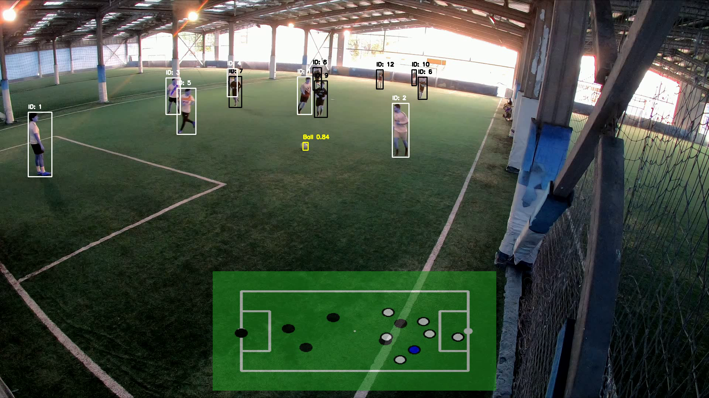

# ⚽️ Análisis de Video de Fútbol usando Visión por Computadora 🧠📊

¡Bienvenido al proyecto de **Obtención de mapa de pases utilizando Visión por Computadora**! Este proyecto de título se enfoca en aplicar técnicas de visión por computadora para analizar partidos de fútbol, detectando jugadores y el balón, aplicando re-identificación a los jugadores, y realizando un seguimiento de los movimientos en el campo. El objetivo final es proporcionar información táctica, como las posiciones de los jugadores y mapas de pases.

---

## 🚀 Algunas caracteríscicas

- **Detección de Jugadores y Balón**: Detección precisa utilizando el modelo YOLOv8.
- **Seguimiento de Objetos**: Seguimiento continuo de jugadores y balón usando técnicas de Re-ID.
- **Homografía del Campo**: Visualización de las detecciones en un campo de fútbol 2D virtual.
- **Generación de Mapas de Pases**: Automatización para generar mapas de pases a partir de videos de partidos.

---

## 🎯 Objetivos

Proveer un mapa de pases a partir de la ejecución del proyecto.

## 📄 Ejemplo de Mapa de Pases
Aquí tienes un ejemplo de un mapa de pases generado por el proyecto:

[🔗 Ver Mapa de Pases (PDF)](docs/mapa_pases.pdf)

---

## 🛠️ Tecnologías utilizadas
- YOLOv8 para la detección de objetos. [Un modelo de detección para balón y otro para jugadores]
- Decord para el procesamiento de video
- Open CV para realizar proyecciones de homografía y coordenadas.
- Modelo de re-identificación entrenado con TorchREID.
- Proyecto probado en python **3.11**
## 📝 Cómo usar el proyecto

Asegúrate de tener todos los modelos necesarios en la carpeta models/:

players.onnx (modelo para detección de jugadores).
ball.onnx (modelo para detección del balón).
model.pth.tar-300 (modelo de reidentificación).

Coloca un video de prueba en la carpeta videos/ 

Ejecuta el script principal **python main.py**

Al finalizar, encontrarás los resultados generados:

Archivos llamados **posiciones.xlsx, limpieza.xlsx, pases.xlsx, pases_by_equipo_blanco.xlsx,  pases_by_equipo_negro.xlsx**. 

Cada uno de estos extrae información distinta de alto valor.

Un video anotado llamado **Pruebas-output.avi** que muestra las detecciones y las trayectorias.

## 📂 Archivos Faltantes

El proyecto requiere algunos archivos adicionales que no están incluidos directamente en el repositorio debido a su tamaño. A continuación, se listan los archivos necesarios junto con sus enlaces de descarga y su ubicación esperada dentro del proyecto:

### 1. **Modelo de Re-ID**
   Este modelo es esencial para la reidentificación de los jugadores durante el análisis de los videos.

   **Descarga aquí**: [🔗 Descargar Modelo de Re-ID](https://drive.google.com/file/d/1WUUdcJ29A11i1zoipnq7mqQZeR84V_PV/view?usp=sharing)

   **Ubicación esperada**:  
   Coloca este archivo en la carpeta `models/` (crea esta carpeta si no existe).

### 2. **Video para Pruebas**
   Utiliza este video para probar el pipeline completo del proyecto.

   **Descarga aquí**: [🔗 Descargar Video de Prueba](https://drive.google.com/file/d/1vVypn9X0mfgurgtj4fmnpGnsMn8SDMpw/view?usp=drive_link)

   **Ubicación esperada**:  
   Coloca este archivo en la carpeta `videos/` (crea esta carpeta si no existe).

## ⚠️ El proyecto está en desarrollo, pronto se añadirán las instrucciones detalladas, de momento solo realiza lo que se detalla en las instrucciones.

## 👥 Autores

- **Matías Millacura** - [@matiasmillacura](https://github.com/matiasmillacura) 
- **Matías Sepúlveda** - [@sepuuu](https://github.com/sepuuu) 

