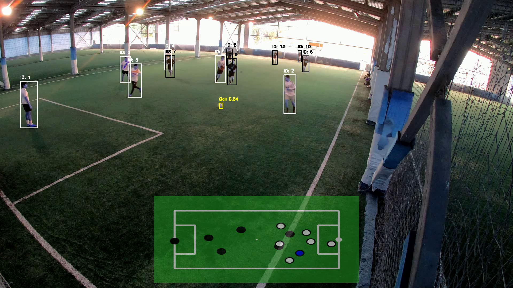

# Analisis Multicam de Futbol con Vision por Computadora

Proyecto de titulo para analisis tactico de futbol usando deteccion, tracking, ReID, proyeccion a cancha y render final multicamara.

El flujo actual del proyecto ya no gira en torno a ejecutar un `main.py` unico. La entrada recomendada es [`codes/run_pipeline.py`](codes/run_pipeline.py), que orquesta export, stitching, matching entre camaras, revision manual-visual y render final.



## Resumen

El pipeline actual hace lo siguiente:

- Detecta jugadores y balon en dos camaras.
- Trackea por camara y exporta artefactos intermedios.
- Une tracklets fragmentados dentro de cada camara.
- Calcula un mapping global entre camaras.
- Genera una etapa de revision manual-visual para corregir IDs.
- Recalcula el mapping final y renderiza el video final con GIDs corregidos.

## Flujo actual del pipeline

Entrada recomendada:

```bash
python codes/run_pipeline.py
```

Secuencia real:

1. `export`
   Ejecuta `main_dualcam.py` con `PIPELINE_STAGE=export`.
   Genera tracking bruto por camara, detecciones del balon, metricas y artefactos base.

2. `offline_stitch`
   Ejecuta `offline_stitch.py`.
   Une tracklets fragmentados dentro de cada camara y genera CSV stitched.

3. `offline_crosscam`
   Ejecuta `offline_crosscam.py`.
   Propone un primer mapping global entre `cam1` y `cam2`.

4. `manual_review`
   Ejecuta `manual_review.py`.
   Genera artefactos visuales en `RUN_DIR/debug_viz/`, prepara `manual_overrides.json` y, si la consola es interactiva, pausa el pipeline para que puedas revisar y editar los overrides.

5. `offline_crosscam` final
   Se ejecuta nuevamente para reaplicar `manual_overrides.json` y reconstruir el mapping global final.

6. `render`
   Ejecuta `main_dualcam.py` con `PIPELINE_STAGE=render`.
   Usa los tracks stitched y el mapping corregido para exportar el video final.

## Estructura importante del repo

```text
codes/
  config.py
  run_pipeline.py
  main_dualcam.py
  offline_stitch.py
  offline_crosscam.py
  manual_review.py
  debug_viz.py
  configs/
  utils/
  postprocess/
  inputs/
  models/
  outputs/
runs/
  default/
docs/
```

## Requisitos

- Python 3.11 recomendado
- Dependencias en `requirements.txt`

Instalacion:

```bash
pip install -r requirements.txt
```

Tambien puedes usar:

```bash
setup.bat
```

## Archivos esperados

Por defecto, `codes/config.py` espera estos archivos:

- Videos:
  - `codes/inputs/video_largo_blancos_nuevo.mp4`
  - `codes/inputs/video_largo_negros_nuevo.mp4`
- Modelos:
  - `codes/models/players.onnx`
  - `codes/models/ball.onnx`
  - `codes/models/model.pth.tar-300`

Si tus archivos tienen otro nombre o ubicacion, ajusta las rutas en [`codes/config.py`](codes/config.py).

## Salidas principales

El pipeline escribe la mayor parte de sus artefactos en `RUN_DIR`, que por defecto es:

```text
runs/default/
```

Artefactos importantes por etapa:

- Export:
  - `c1_tracks.csv`
  - `c2_tracks.csv`
  - `ball.csv`
  - `METRICS.csv`
  - `Posiciones-jugadores-balon-multicam.xlsx`
  - `meta.json`

- Stitch:
  - `c1_tracks_stitched.csv`
  - `c2_tracks_stitched.csv`
  - `c1_stitched_embeddings.npz`
  - `c2_stitched_embeddings.npz`
  - `c1_map_stitch.json`
  - `c2_map_stitch.json`
  - `report_stitch.csv`

- Crosscam:
  - `crosscam_map.json`
  - `report_crosscam.csv`
  - `report_crosscam_summary.csv`
  - `global_tracks.csv`
  - `crosscam_align.json`

- Revision manual-visual:
  - `debug_viz/`
  - `manual_overrides.json`
  - `manual_overrides.template.json`
  - `manual_review_instructions.txt`

- Render final:
  - Video final en la ruta configurada por `PATHS.video_output`
  - Video con IDs locales
  - Video del radar

Por defecto, el video final queda en:

```text
codes/outputs/Pruebas-output-final.mp4
```

Si activas `ALSO_WRITE_CODES_DATA = True` en `config.py`, tambien se escriben copias de algunos artefactos en `codes/data/`.

## Revision manual-visual

La revision manual ya forma parte del pipeline.

Durante `manual_review` se generan videos e imagenes en:

```text
runs/default/debug_viz/
```

Por defecto se generan estos artefactos visuales:

- `04_render_radar_all_with_gid.mp4`
- `05_crosscam_pair_error_lines.mp4`
- `08_combined_cams_gid.mp4`
- `09_combined_teams_gid.mp4`
- `10_voronoi_radar_teams.mp4`

Ademas se crea un archivo editable:

```text
runs/default/manual_overrides.json
```

Formato esperado:

```json
{
  "players": {
    "1": { "cam1": [1, 38], "cam2": [4] },
    "2": { "cam1": [5], "cam2": [7, 9] }
  },
  "special_segments": {
    "cam1": [],
    "cam2": []
  }
}
```

Interpretacion:

- La clave `"1"` o `"2"` es el GID final que quieres imponer.
- `cam1` y `cam2` contienen los `stable_id` stitched que pertenecen a ese jugador.
- `special_segments` es opcional y hoy se usa principalmente en `debug_viz.py` para casos por rango de frames.

Si ejecutas el pipeline en una consola interactiva, el proceso pausa antes del render final para que puedas revisar los videos y editar `manual_overrides.json`.

## Como usar

1. Deja los modelos en `codes/models/`.
2. Deja los videos en `codes/inputs/`.
3. Ajusta rutas o nombres en [`codes/config.py`](codes/config.py) si es necesario.
4. Ejecuta:

```bash
python codes/run_pipeline.py
```

5. Revisa los artefactos en `runs/default/`.
6. Si el pipeline pausa en `manual_review`, revisa `runs/default/debug_viz/`, edita `runs/default/manual_overrides.json` y luego continua.

## Postproceso opcional

El proyecto todavia conserva un postproceso en [`codes/postprocess/postprocess.py`](codes/postprocess/postprocess.py) para posesion, pases y mapas derivados.

Ese postproceso no es la entrada principal del pipeline actual. Si lo usas, revisa primero que las columnas esperadas por el postproceso coincidan con los artefactos que estas exportando.

## Configuracion util

La mayor parte de los ajustes esta en [`codes/config.py`](codes/config.py).

Bloques utiles:

- Rutas:
  - `PATHS.video_cam1`
  - `PATHS.video_cam2`
  - `PATHS.video_output`
  - `PATHS.reid_checkpoint`
  - `PATHS.player_detector_path`
  - `PATHS.ball_detector_path`

- Pipeline:
  - `RUN_DIR`
  - `OFFLINE_MAP_PATH`
  - `PIPELINE_ENABLE_MANUAL_REVIEW`
  - `PIPELINE_MANUAL_REVIEW_PAUSE`
  - `PIPELINE_MANUAL_REVIEW_RERUN_CROSSCAM`

- Render / export:
  - `RENDER_USE_STITCHED`
  - `RENDER_MAPPED_ONLY`
  - `RAW_POS_MODE`

- Crosscam:
  - `CROSSCAM_POS_THR`
  - `CROSSCAM_REID_THR`
  - `CROSSCAM_ACCEPT_MARGIN`
  - `CROSSCAM_ENABLE_ALIGN`

- Debug visual:
  - `DEBUG_VIZ_VIDEO_TARGETS`
  - `DEBUG_APPROX_SECOND`
  - `DEBUG_FRAME_WINDOW`

## Comandos utiles

Pipeline completo:

```bash
python codes/run_pipeline.py
```

Solo stitching:

```bash
python codes/offline_stitch.py
```

Solo crosscam:

```bash
python codes/offline_crosscam.py
```

Solo revision visual:

```bash
python codes/manual_review.py --no-pause
```

Solo debug visual:

```bash
python codes/debug_viz.py
```

## Nota sobre el estado del proyecto

El repositorio esta en desarrollo y conserva algunas piezas heredadas del flujo anterior. Si algo en el README parece contradecir el comportamiento real del codigo, toma como fuente principal:

- `codes/config.py`
- `codes/run_pipeline.py`
- `codes/main_dualcam.py`
- `codes/offline_stitch.py`
- `codes/offline_crosscam.py`
- `codes/manual_review.py`

## Autores

- Matias Millacura - [@matiasmillacura](https://github.com/matiasmillacura)
- Matias Sepulveda - [@sepuuu](https://github.com/sepuuu)
